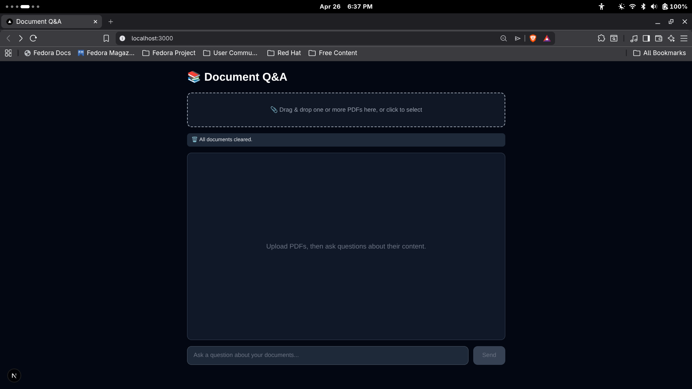

# Local Document Q&A

### FastAPI • Next.js • Ollama • ChromaDB

A fully local, end-to-end Retrieval-Augmented Generation (RAG) system for querying PDF documents with grounded answers.

This project is designed to demonstrate a **practical, production-aligned local RAG pipeline**, combining document ingestion, vector retrieval, and LLM-based answer synthesis — all running entirely offline with full data control.

Unlike typical demos, this system emphasizes **traceability, persistence, and modular design**, making it a strong foundation for building document-aware AI systems.

---

## Demo

### Video Walkthrough

[](https://youtu.be/dA1BohM-aq0)

### Screenshots



---

## Core Capabilities

- Local PDF ingestion and processing pipeline
- Semantic chunking with metadata tracking
- Persistent vector storage using ChromaDB
- Multi-document retrieval with scoped querying
- Grounded answer generation using local LLMs
- Source attribution for retrieved context
- Document-level lifecycle management (add/delete/clear)
- Clean, minimal interface optimized for rapid interaction

---

## System Architecture

```
User → Next.js Frontend → FastAPI Backend → ChromaDB (Vectors) + Ollama (LLM) → Answer
```

---

## Architecture & Design Decisions

### Local-first RAG pipeline

All stages — embedding, retrieval, and generation — run locally via Ollama. This ensures:

- zero external dependencies
- full data privacy
- predictable latency

---

### Persistent vector storage

ChromaDB stores embeddings on disk, allowing:

- document reuse across sessions
- no need for reprocessing on restart
- consistent retrieval state

---

### Metadata-driven retrieval

Each chunk is stored with:

- `doc_id`
- source filename
- chunk index

This enables:

- scoped queries across selected documents
- traceable source attribution
- deterministic filtering

---

### Retrieval before generation (strict grounding)

The system injects only retrieved chunks into the prompt, enforcing:

- reduced hallucination risk
- answer traceability
- context-bounded responses

---

### Stateless backend design

The backend does not maintain session state. Document scope is controlled by the client, keeping the API:

- simple
- horizontally scalable (in principle)
- easy to extend

---

## Tech Stack

| Layer         | Technology                 |
| ------------- | -------------------------- |
| Frontend      | Next.js, React, TypeScript |
| Backend       | FastAPI, Python            |
| Vector Store  | ChromaDB                   |
| Model Runtime | Ollama                     |
| PDF Parsing   | PyPDF2                     |
| Chunking      | LangChain Text Splitters   |
| Styling       | Tailwind CSS               |

---

## Project Structure

```bash
document-qa/
├── backend/
│   ├── main.py
│   ├── requirements.txt
│   └── chroma_db/
└── frontend/
    ├── package.json
    └── app/
        ├── layout.tsx
        └── page.tsx
```

---

## API

### `POST /upload`

Processes and stores a document.

- Extracts text
- Splits into chunks
- Generates embeddings
- Stores in ChromaDB

```json
{
  "message": "Uploaded sample.pdf with 12 chunks",
  "doc_id": "uuid-string"
}
```

---

### `POST /ask`

Performs retrieval + generation.

```json
{
  "question": "What is this document about?",
  "top_k": 3,
  "doc_ids": ["uuid-1", "uuid-2"]
}
```

```json
{
  "answer": "The document discusses ...",
  "sources": ["sample.pdf (chunk 0)", "sample.pdf (chunk 1)"]
}
```

---

### `GET /documents`

Returns indexed documents.

---

### `DELETE /documents/{doc_id}`

Deletes a document and its vectors.

---

### `DELETE /clear`

Clears the entire vector store.

---

### `GET /health`

Service health check.

---

## Local Setup

### 1. Clone

```bash
git clone https://github.com/Uthso66/document-qa.git
cd document-qa
```

---

### 2. Start Ollama

```bash
ollama pull llama3.2:3b
ollama serve
```

Default:

```
http://localhost:11434
```

---

### 3. Backend

```bash
cd backend
pip install -r requirements.txt
python main.py
```

```
http://localhost:8000
```

---

### 4. Frontend

```bash
cd frontend
npm install
npm run dev
```

```
http://localhost:3000
```

---

## Configuration

| Component   | Default                |
| ----------- | ---------------------- |
| Backend API | http://localhost:8000  |
| Ollama API  | http://localhost:11434 |
| Vector Path | ./chroma_db            |
| Model       | llama3.2:3b            |

---

## Retrieval Pipeline

1. Document uploaded
2. Text extracted
3. Chunked into overlapping segments
4. Embeddings generated locally
5. Stored with metadata in ChromaDB
6. Query received
7. Top-K chunks retrieved
8. Context injected into prompt
9. LLM generates grounded response
10. Sources returned alongside answer

---

## Limitations

- No OCR (scanned PDFs not supported)
- Retrieval quality depends on chunking strategy
- No re-ranking or hybrid search (BM25 + vector)
- No authentication or user isolation
- Performance constrained by local hardware

---

## Roadmap

- OCR integration for scanned documents
- Hybrid retrieval (vector + keyword search)
- Re-ranking layer for improved relevance
- Streaming response generation
- Model parameter tuning interface
- Multi-user document isolation
- Dockerized deployment

---

## Author

Uthso  
Software QA Engineer • Security Enthusiast • AI/ML Practitioner

- GitHub: https://github.com/Uthso66
- LinkedIn: https://www.linkedin.com/in/tarikul-islam-uthso/

---

## License

MIT License © 2025 Uthso
